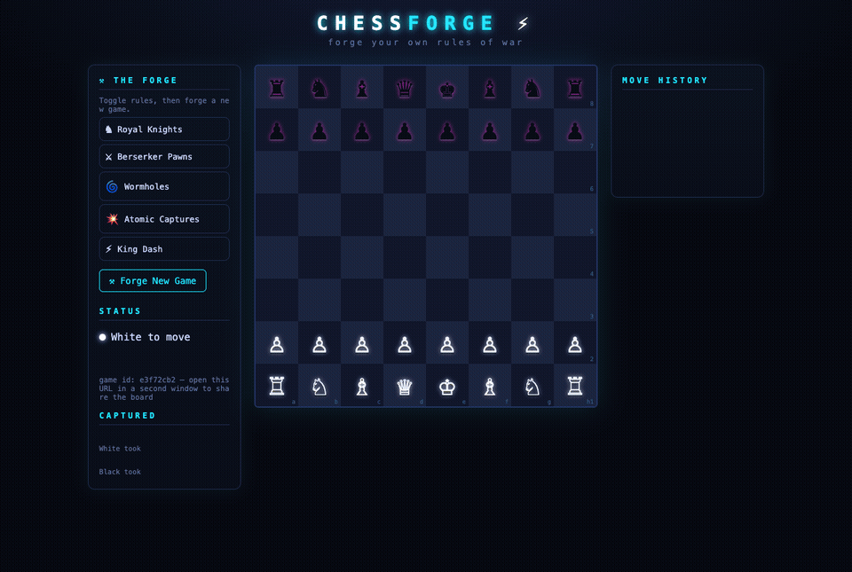

# Chess Forge ⚡

A futuristic chess web app where you don't just play chess — you **forge your own chess variant**.
Toggle rule modifiers (wormhole squares, atomic captures, royal knights, berserker pawns, king dash…)
and the server-side rules engine recomputes legality, check, and mate under *your* rules.

Built for the CMU DevOps course loop-engineering assignment using an AI assistant driven by an
iterative agent loop (specify → plan → build-loop, twice: base system then extension).



*Demo: fool's mate in plain chess, then a forged game (Royal Knights + Wormholes + Atomic
Captures) — watch the opening pawn ride the e4→d5 wormhole and the c7 capture vaporize black's
queenside. Recorded headlessly with [scripts/record-demo.mjs](scripts/record-demo.mjs)
(`npm start`, then `node scripts/record-demo.mjs` + ffmpeg).*

- **Backend:** Node.js + Express, custom chess engine (no chess libraries), server-authoritative.
- **Frontend:** Vanilla HTML/CSS/JS single-page app.
- **Persistence:** In-memory game store (no database required to run — TA-friendly).

## Quick start

```bash
npm install
npm start          # serves http://localhost:3000
npm test           # engine + API tests
```

See [running.md](running.md) for full instructions, [SPEC.md](SPEC.md) / [SPEC-EXTENSION.md](SPEC-EXTENSION.md)
for what was built, and [prompts.txt](prompts.txt) for every prompt used to build it.

## Assignment structure

| Step | Stage | Artifact | Loop? |
|------|-------|----------|-------|
| 1 — Base chess app | specify | SPEC.md | no |
| 1 | plan | PLAN.md | no |
| 1 | build | server/, public/, tests | **yes** (iterate until PLAN.md checklist done) |
| 2 — Rule Forge extension | specify | SPEC-EXTENSION.md | no |
| 2 | plan | PLAN-EXTENSION.md | no |
| 2 | build | rule modifiers + UI + tests | **yes** |

One commit per stage minimum; the build-loop stages commit once per loop iteration.
